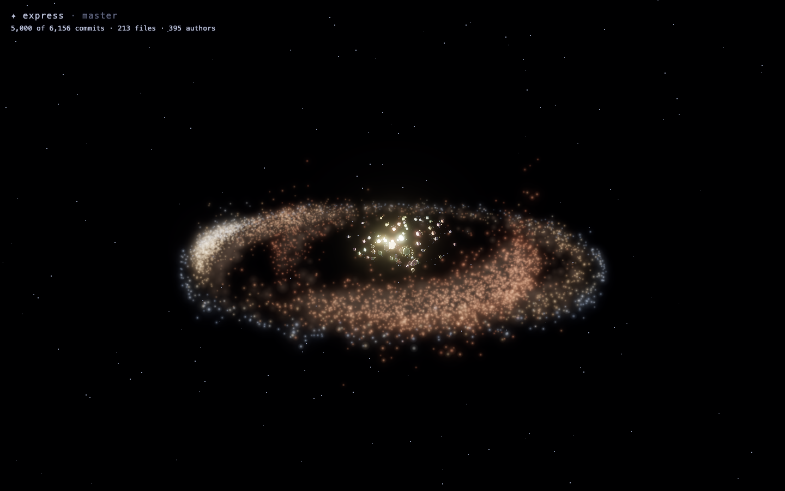
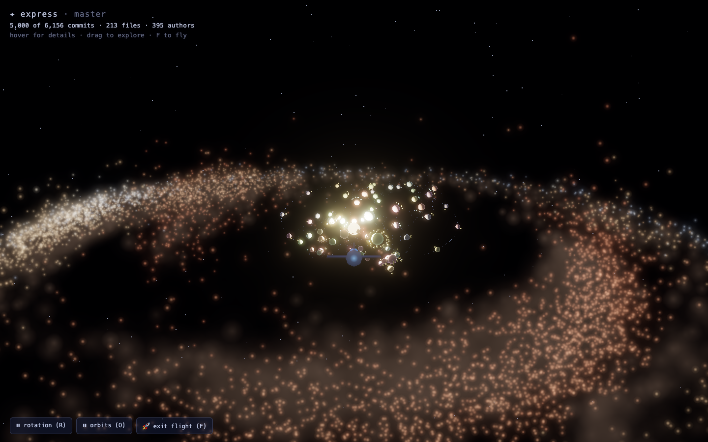
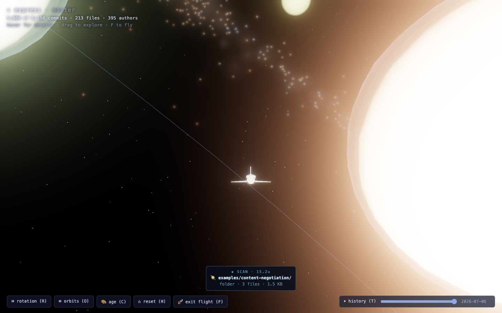
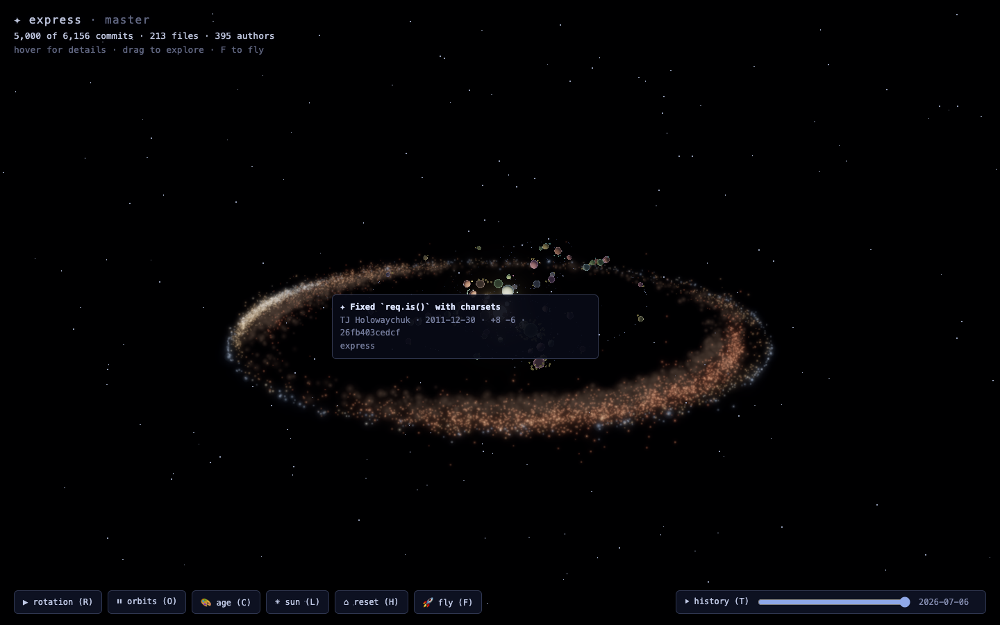
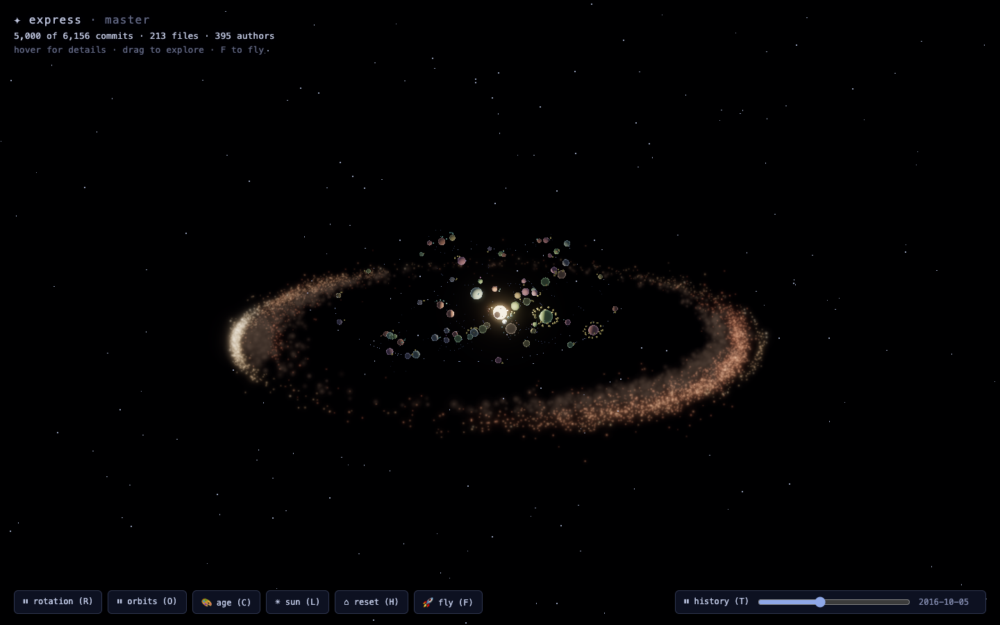
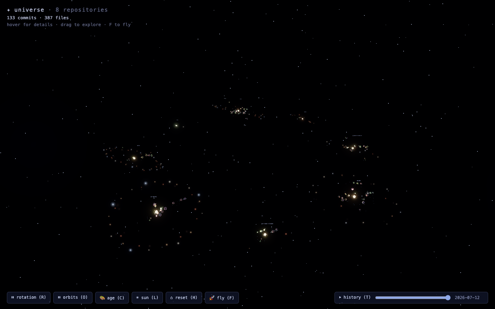

# Git Galaxy 🌌

Every repository becomes a galaxy. **Stars are commits. Planets are folders. Satellites are files.** Pure eye candy.

Point it at any local git repo — or a whole directory of them — and explore your code's history as an animated 3D universe in the browser. Or press `F` and **fly through it in a Space Shuttle**.

**[▶ Live demo](https://michael-baker-us.github.io/git-galaxy/?repo=expressjs/express)** — no install; enter any public GitHub repo and it renders in your browser (works on phones). The hosted version fetches via the GitHub API, so star sizes are uniform and history is capped at 1,000 commits — run the CLI locally for full fidelity.



## Quick start

```bash
npm install
npm run build
node packages/server/dist/cli.js /path/to/any/repo --open   # one repo → a galaxy
node packages/server/dist/cli.js ~/repos --open             # many repos → a universe
```

## The spaceship 🚀

`F` spawns a low-poly Space Shuttle orbiter ahead of your view. Pointer-locked mouse steers, `W`/`S` throttle, `A`/`D` roll, `Shift` boosts. `Esc` or `F` hands you back to orbit controls, aimed wherever you were heading.



While flying, the shuttle **scans whatever it passes** — the nearest commit, folder, or file appears in a HUD readout with its distance. Here, threading through express's nucleus, it's picked up a file 6.6 units away:



## What you're looking at

**The galactic disc is time.** The core is the project's earliest history; the rim is now.

- The most prolific **authors each own a spiral arm**; everyone else scatters as field stars. Repos with fewer than three authors fall back to a golden-angle phyllotaxis spiral.
- **Star color** is a temperature ramp over age — the newest commits burn blue-white, the oldest fade to deep red. You can see where a project is alive.
- **Star size follows churn** (`log(insertions + deletions)`) — big refactors blaze, typo fixes twinkle. Merge commits get a brightness bonus.
- **Dark dust lanes** thread the arms, and a faint unresolved-starlight band traces them, the way a long exposure renders stars a camera can't separate.

**The living codebase is the galactic nucleus.** The file tree at HEAD sits at the center as a solar system: the root folder is the sun (and the scene's light source — planets have day and night sides), subfolders orbit as planets on individually tilted planes following Kepler's third law, and files swarm as satellites colored by extension. History spirals around the code that produced it.

Small repos get a compact disc with fatter stars; a 20-commit project reads as a cozy young cluster, not a scatter of lonely dots.

## Exploring

| Input | What it does |
|---|---|
| drag / scroll | orbit and zoom (grabbing the camera pauses auto-rotation) |
| hover | **tooltips**: stars show the commit (subject, author, date, churn), planets the folder, satellites the file, suns the repo |
| `T` | **play the repo's history** — stars ignite in commit order with a scrubber and date readout |
| `C` | **author colors** — crossfade the starfield from age ramp to one distinct hue per contributor |
| `R` / `O` | pause/resume galaxy rotation and orbital motion, independently |
| `F` | **board the spaceship** 🚀 |
| `H` | reset to the first-open view, intro and all |

Every object in the scene explains itself on hover — this star is a real commit:



Press `T` and the history unfolds from the first commit outward — here express is
mid-playback in 2016, its outer rim still unborn:



### Universe mode

Point the CLI at a directory of repositories (e.g. `~/repos`) and each becomes its own labeled galaxy, arranged on a great ring sized so galaxies never overlap (up to 24 repos). The history timeline is normalized across the whole universe, so galaxies ignite in the order your projects were actually started.



## CLI

```
git-galaxy [path] [options]

  path                  A git repository, or a directory of repositories
                        (default: current directory)
  -p, --port <n>        Port to serve on (default: 4242)
      --max-commits <n> Cap on commits fetched per repo, newest first (default: 5000)
      --open            Open the browser once the galaxy is ready
```

Friendly failure modes: non-repo paths exit with a clear message, zero-commit repos render an empty galaxy instead of crashing, and if another instance already holds the port it tells you which repo it's serving.

## Development

```bash
npm run dev        # tsx-watched server (this repo) + Vite dev server with /api proxy
npm test           # Vitest across all packages (parsers, layout math, integration)
npm run typecheck  # tsc --noEmit per package
npm run lint       # Biome
```

`#system` in the URL deep-links the camera to the folder system. `window.__gg` exposes the scene assemblies and camera so e2e scripts can project objects to screen coordinates.

## Architecture

npm workspaces, three packages:

| Package | What it is |
|---|---|
| `@git-galaxy/shared` | The API contract (`UniverseSnapshot`) + pure layout math (spiral placement, orbital ring-packing, color ramps). No Three.js, no Node APIs — fully unit-tested and deterministic (same repo, same galaxy). |
| `@git-galaxy/server` | CLI + Express server. Spawns git plumbing (`log --numstat`, `ls-tree -r -l -z`) behind a `RepoSource` interface, discovers repos, serves `GET /api/universe` and the built frontend. |
| `@git-galaxy/web` | Vite + Three.js renderer: the whole starfield is three draw calls (unresolved glow, dust lanes, crisp stars) over one geometry, with timeline and color mode as pure shader uniforms. ACES tone mapping + restrained bloom. |

See [docs/architecture.md](docs/architecture.md) for the design decisions, tradeoffs, and the orbit-packing lesson learned the hard way.
